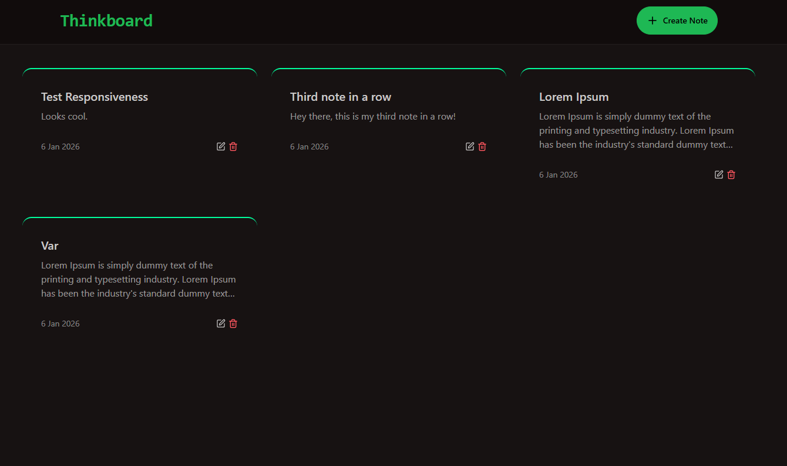

# Thinkboard

**Thinkboard** is a simple, responsive **MERN stack** application for creating and managing notes.  
Each note consists of a **title** and **content**, with full support for **create, edit, and delete** operations.

---

## Preview

---

## Features

- Create notes with title and content
- Edit existing notes
- Delete notes
- Fully responsive design
- Fast UI with modern React tooling
- Styled with Tailwind CSS + DaisyUI

---

## Tech Stack

### Frontend

- React
- Vite
- Tailwind CSS
- DaisyUI
- Axios
- React Router

### Backend

- Node.js
- Express
- MongoDB
- Mongoose

---
